# Pull Request Workflow via Cursor

This document outlines the standard workflow for making changes to the codebase through Pull Requests.

## Steps

### 1. Create a Branch

Before making any changes, create a new branch from the main branch:

```bash
# Switch to main branch and pull latest changes
git checkout main
git pull

# Create and switch to a new branch
git checkout -b your-feature-name
```

Replace `your-feature-name` with a descriptive name for your changes.

### 2. Make and Commit Changes

After making your changes, use the "AI" chat to commit them:

1. Review the changes
2. Type "Commit changes" in the chat - this command will:
   - Create a properly formatted commit message following the commit guidelines
   - Push your changes to the remote repository


### 3. Create a Pull Request

Once your changes are committed and pushed, create a pull request:

1. Type "Create pull request" in the chat - this command will:
   - Generate `title` and `description` according to the PR guidelines
   - Create or update the PR with generated `title` and `decription`


## Workflow Diagram

```mermaid
flowchart LR
    A[Start] --> B[Checkout main branch]
    B --> C[Pull latest changes]
    C --> D[Create feature branch]
    D --> E[Make code changes]
    E --> F[Review changes]
    F --> G[Commit changes via AI chat]
    G --> I[Create PR via AI chat]
    I --> J[PR review process]
    
    style A fill:#f9f,stroke:#333,stroke-width:2px
    style J fill:#9f9,stroke:#333,stroke-width:2px
```



## Notes

- Ensure your branch is up to date with the main branch before creating a PR
- Follow the commit message and PR description formatting guidelines for consistency 