# SF Website AWS Architecture

## Principal AWS Architecture Diagram

```mermaid
flowchart TB
    %% External actors
    Users[👥 Users]
    GitHub[🐙 GitHub Actions CI/CD]
    
    %% Public facing components
    ALB[⚖️ Application Load Balancer<br/>sf-website-alb-env<br/>HTTPS Only]
    CF[🌐 CloudFront Distribution<br/>sf-website-media-env<br/>CDN for Media Assets]
    
    %% Compute layer
    ECS[🚢 ECS Fargate Cluster<br/>sf-website-ecs-cluster-env<br/>Apostrophe CMS App]
    ECR[🐳 ECR Repository<br/>sf-website-ecr-env<br/>Container Images]
    
    %% Storage layer
    S3_Attachments[🪣 S3 Attachments Bucket<br/>sf-website-s3-attachments-env<br/>Media & Files]
    S3_Logs[🪣 S3 Logs Bucket<br/>sf-website-s3-logs-env<br/>Centralized Logs]
    MongoDB[📄 MongoDB on EC2<br/>sf-website-mongodb-env<br/>t3.medium + 100GB EBS]
    
    %% Security & Identity
    IAM_Task[👤 ECS Task Role<br/>sf-website-ecs-task-env<br/>S3 Access Permissions]
    IAM_Exec[👤 ECS Execution Role<br/>sf-website-ecs-execution-env<br/>ECR & Parameter Store]
    ParamStore[🔐 Parameter Store<br/>Session Secrets & DB Credentials]
    
    %% Monitoring & Backup
    CloudWatch[📊 CloudWatch<br/>sf-website-cloudwatch-env<br/>Logs & Metrics]
    AWSBackup[💾 AWS Backup<br/>Daily EBS Snapshots<br/>7 daily, 4 weekly retention]
    
    %% User flows
    Users -->|HTTPS requests| ALB
    Users -->|Media requests| CF
    
    %% CI/CD flow
    GitHub -->|Build & Push| ECR
    GitHub -->|Deploy| ECS
    
    %% Load balancer to application
    ALB -->|Route traffic| ECS
    
    %% CloudFront to storage
    CF -->|Origin requests| S3_Attachments
    
    %% ECS relationships
    ECS -->|Pull images| ECR
    ECS -->|Read/Write media| S3_Attachments
    ECS -->|Database operations| MongoDB
    ECS -->|Get secrets| ParamStore
    ECS -->|Send logs| CloudWatch
    
    %% IAM relationships
    IAM_Task -.->|Assume role| ECS
    IAM_Exec -.->|Assume role| ECS
    IAM_Task -.->|S3 permissions| S3_Attachments
    IAM_Exec -.->|ECR permissions| ECR
    IAM_Exec -.->|Parameter Store| ParamStore
    
    %% Logging flows
    ALB -->|Access logs| S3_Logs
    CF -->|Access logs| S3_Logs
    S3_Attachments -->|Server logs| S3_Logs
    
    %% Monitoring
    ECS -->|Metrics & logs| CloudWatch
    ALB -->|Metrics| CloudWatch
    MongoDB -->|System metrics| CloudWatch
    
    %% Backup
    AWSBackup -->|Snapshot| MongoDB
    
    %% Styling
    classDef public fill:#e1f5fe
    classDef compute fill:#f3e5f5
    classDef storage fill:#e8f5e8
    classDef security fill:#fff3e0
    classDef monitoring fill:#fce4ec
    
    class ALB,CF public
    class ECS,ECR compute
    class S3_Attachments,S3_Logs,MongoDB storage
    class IAM_Task,IAM_Exec,ParamStore security
    class CloudWatch,AWSBackup monitoring
```

## Key Architecture Components

### 🌐 Public Layer
- **Application Load Balancer**: HTTPS-only entry point for web traffic
- **CloudFront**: Global CDN for media asset delivery from S3

### 🚢 Compute Layer
- **ECS Fargate**: Serverless container hosting for Apostrophe CMS
- **ECR**: Private container registry for application images

### 🪣 Storage Layer
- **S3 Attachments**: Media files and uploads from CMS
- **S3 Logs**: Centralized logging for all services
- **MongoDB on EC2**: Primary database with automated backups

### 👤 Security Layer
- **IAM Roles**: Least-privilege access for ECS tasks
- **Parameter Store**: Secure storage for secrets and configuration

### 📊 Operations Layer
- **CloudWatch**: Monitoring, metrics, and alerting
- **AWS Backup**: Automated daily snapshots with retention policies

## Environment Isolation
All resources are tagged and named with environment suffix:
- `dev`, `staging`, `prod`
- Complete isolation between environments
- Consistent naming: `sf-website-<service>-<env>` 